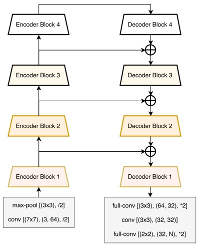
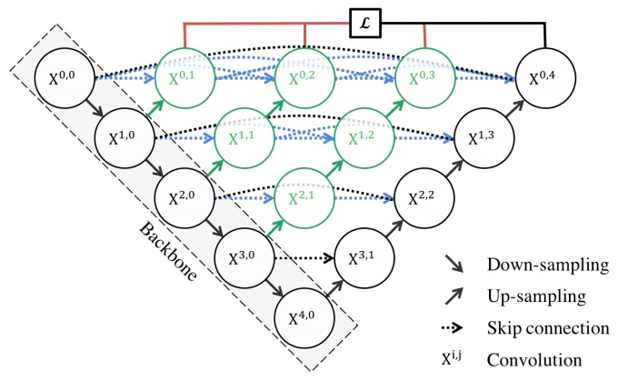
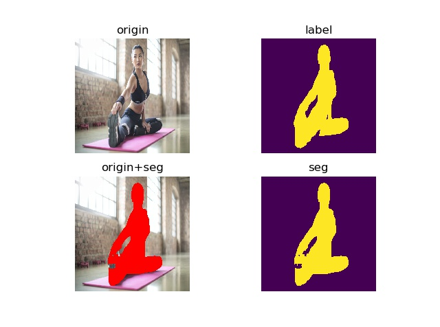

#Person Segmentation
##Introduction
we implement two versions of the model,
one of which is a real-time high-precision version on GPU platform and
 the other is a real-time version on CPU platform.


model    |   input size   | Val iou (Supervisely) |    Val iou (Whole)    |  speed  (FPS) | Size (MB)
---------|------------------------|------------------|----------------------|-----------  | ----
Linknet_res18     | 640 | 88% | 78% | 100 (P40)  | 44 
Unet++     |  256 | 56% | --- | 24 (CPU)   |  1.58 

##Datasets

  Dataset  |   Train   | Val 
---------|------------------------|------------------
[Supervisely](https://supervise.ly/)     | 4757 | 526 
[VOC_person](http://host.robots.ox.ac.uk/pascal/VOC/)    |  401 | 44
[COCO_person](http://cocodataset.org/#download)     |  58023 | 6411 
[COCO_negtive](http://cocodataset.org/#download)     |  54172 | 0 
[VIP](http://www.sysu-hcp.net/lip/)     |  16702 | 1846 
[TRIMODAL](https://www.kaggle.com/aalborguniversity/trimodal-people-segmentation)     |  5722 | 0 
Total |  139777 | 8827 
##Models
1). [Linknet](https://arxiv.org/abs/1707.03718)

we use linknet_res18 as the model to implement the real-time high-precision version on GPU platform



2). [Unet++](https://arxiv.org/abs/1807.10165) 

we use unet++ as the model to implement the real-time version on CPU platform. Notice that the model is not the same as the origin unet++ mentioned in paper.
while testing , we only keep X^00 , X^01 , X^10 to do the inference .



##Demo

simply run the command below to try the demo
```
python ./demo/demo.py 
```




 